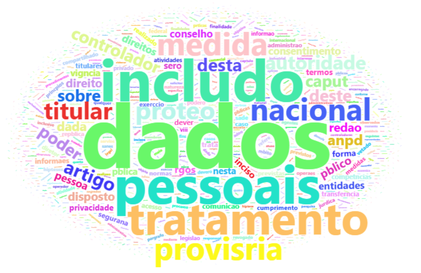
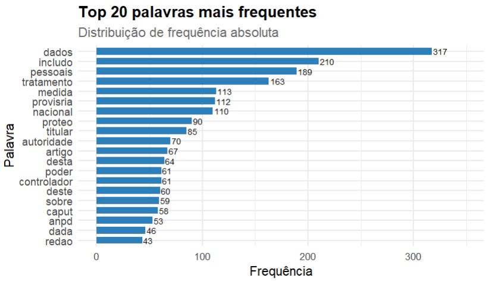
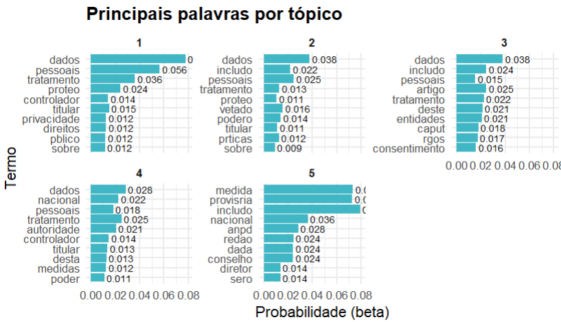
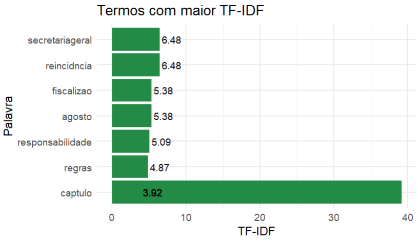

# 📌 Projeto Profissional de Pré-processamento e Processamento de Texto em R

📌 Visão Geral

Este projeto apresenta um pipeline completo de Processamento de Linguagem Natural (NLP) desenvolvido em linguagem R, 
abrangendo desde a coleta e limpeza de textos até análise exploratória, modelagem de tópicos, métricas de relevância (TF-IDF) e visualização interativa com Shiny.

O projeto segue boas práticas profissionais, sendo adequado para portfólio, contexto acadêmico e aplicações em políticas públicas, 
como saúde, educação, reclamações institucionais e análise de textos legais (ex.: LGPD).

---

## 📌 Objetivos do Projeto

- Realizar pré-processamento completo de textos
- Aplicar técnicas de análise exploratória textual
- Identificar termos relevantes e temas latentes
- Criar dashboard interativo com Shiny
- Demonstrar domínio da linguagem R aplicada a NLP

---

## 📌 O que é Processamento de Linguagem Natural (NLP)?

NLP é uma área da ciência de dados que permite analisar, interpretar e extrair informações de textos por meio de métodos computacionais. 
Neste projeto, são utilizadas técnicas clássicas e amplamente aceitas, como:

- Tokenização
- Remoção de stopwords
- Frequência de termos
- TF-IDF
- Modelagem de tópicos (LDA / STM)
- Entre outra técnicas

---

## Imagens geradas no Projeto






---

## 📌 Estrutura do Projeto
```
projeto-nlp-r/
│── app/                        # Dashboard interativo
├── data/
│   ├── raw/                    # Textos originais (TXT)
│   └── processed/              # Textos pré-processados
│── images/                     # Imagens dos gráficos
│── preview/
│   ├── topic_graph.R           # Gráfico de tópicos
│   ├── frequency_graph.R       # Gráfico de frequência     
│   └── graph_relevant_terms.R  # Gráfico de termos relavantes 
├── scripts_R/
│   ├── load_data.R             # Carregamento dos dados
│   ├── modeling_topics.R       # Modelagem de tópicos (LDA)
│   ├── preprocessing.R         # Pré-processamento de texto     
│   └── processing.R            # Processamento de texto     
│── .gitignore
│── .RData
│── .Rhistory
│── .Rprofile
│── main                        # Script principal
│── natural-language-processing-01-r.Rproj
│── README              
├── README.md
└── renv.lock 

```

## 📌 Fases do Projeto

📌 Coleta e Leitura dos Dados

- Leitura de arquivo TXT
- Uso de dados públicos e anonimizados
- Conformidade com a LGPD (sem dados pessoais sensíveis)

📌 Pré-processamento de Texto

Etapa fundamental para garantir qualidade dos resultados.

Inclui:
- Conversão para ASCII
- Padronização para letras minúsculas
- Remoção de números e pontuação
- Remoção de caracteres especiais
- Remoção de linhas em branco
- Normalização de espaços
- Remoção de palavras curtas
- Remoção de stopwords
- Stemização (redução à raiz)

📌 Processamento de Texto

Nesta fase os textos são transformados em estruturas analíticas:

- Tokenização (palavra por palavra)
- Tabela de frequência de termos
- Cálculo de TF-IDF
- Preparação para modelagem estatística

📌 Descoberta de Tópicos

- Aplicação de modelos probabilísticos para identificar temas latentes:
- LDA (Latent Dirichlet Allocation)
- Cada documento é representado como uma mistura de tópicos, e cada tópico como uma distribuição de palavras.

📌 Visualização Interativa com Shiny

O dashboard Shiny permite:
- Visualizar nuvem de palavras
- Consultar tabela de frequência
- Explorar resultados de forma interativa
- Apoiar análise exploratória e apresentação dos dados

📌 Reprodutibilidade total: qualquer pessoa pode executar e obter os mesmos resultados.

---

## 📌 Principais pacotes utilizados

| Pacotes | Descrição |
|---------|-----------|
| tidyverse |	Manipulação e visualização de dados |
| tidytext |	NLP em formato tidy |
| stringr / stringi |	Limpeza e normalização de texto |
| topicmodels	| Modelagem de tópicos (LDA) |
| stm	| Modelagem de tópicos estruturada |
| ggplot2	| Gráficos profissionais |
| shiny	| Dashboards interativos |
| wordcloud2	| Nuvem de palavras |

---

## 📌 Como executar o Projeto

1. 📌 Pré-requisitos:

* [Linguagem R](https://cran.r-project.org/) instalada (versão recomendada: ≥ 4.5.1)
* [RStudio](https://posit.co/download/rstudio-desktop/) instalado
* Instalação da [Linguagem R:](https://informaticus77-r.blogspot.com/2025/09/blog-post.html)
* Microtutorial [RStudio:](https://informaticus77-r.blogspot.com/2025/09/blog-post_8.html)

2. 📌 Clonar este repositório

- Abra o terminal e execute:
```bash
git clone https://github.com/jcarlossc/natural-language-processing-01-r.git
cd natural-language-processing-01-r
```
3. 📌 Ativar ambiente virtual

- Abra o projeto no RStudio.
- Instalar as dependências:
```
# Este comando deve ser executado no console do RStudio.

renv::restore()    
```
4. 📌 Executar o Projeto

```
source("main.R")
```

---

## 📌 Reprodutibilidade

O projeto pode utilizar renv para controle de versões dos pacotes, garantindo que os resultados sejam reproduzíveis em diferentes ambientes.

---

## 📌 Sobre
Este material foi criado para servir como introdução ao R, com exemplos simples e organizados para facilitar o aprendizado inicial.

---

## 📌 Contribuições
Se quiser contribuir:
1. Faça um fork deste repositório
2. Crie uma branch para sua feature ou correção (git checkout -b minha-feature)
3. Faça commits descritos claramente
4. Submeta um Pull Request

---

## 📌 Licença
Este projeto está licenciado sob a MIT License.

---

## 📌 Contatos
📌Autor: Carlos da Costa<br>
📌Recife, PE - Brasil<br>
📌Telefone: +55 81 99712 9140<br>
📌Telegram: @jcarlossc<br>
📌Pypi: [https://pypi.org/user/jcarlossc/](https://pypi.org/user/jcarlossc/)><br>
📌Blogger linguagem R: [https://informaticus77-r.blogspot.com/](https://informaticus77-r.blogspot.com/)<br>
📌Blogger linguagem Python: [https://informaticus77-python.blogspot.com/](https://informaticus77-python.blogspot.com/)<br>
📌Email: jcarlossc1977@gmail.com<br>
📌LinkedIn: https://www.linkedin.com/in/carlos-da-costa-669252149/<br>
📌GitHub: https://github.com/jcarlossc<br>
📌Kaggle: https://www.kaggle.com/jcarlossc/  
📌Twitter/X: https://x.com/jcarlossc1977

